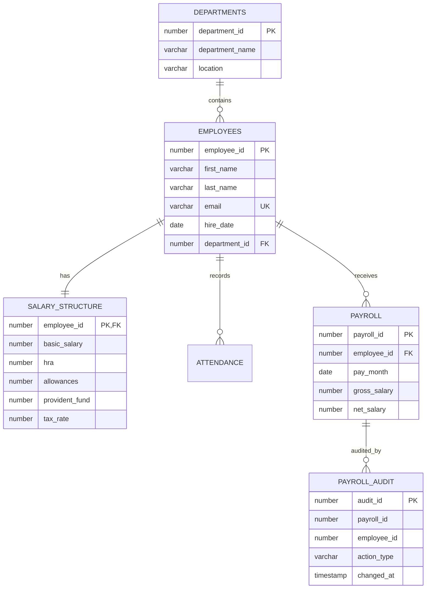

# Entity Relationship Diagram

```mermaid
erDiagram
    DEPARTMENTS ||--o{ EMPLOYEES : contains
    EMPLOYEES ||--|| SALARY_STRUCTURE : has
    EMPLOYEES ||--o{ ATTENDANCE : records
    EMPLOYEES ||--o{ PAYROLL : receives
    PAYROLL ||--o{ PAYROLL_AUDIT : audited_by

    DEPARTMENTS {
      number department_id PK
      varchar department_name
      varchar location
    }
    EMPLOYEES {
      number employee_id PK
      varchar first_name
      varchar last_name
      varchar email UK
      date hire_date
      number department_id FK
    }
    SALARY_STRUCTURE {
      number employee_id PK,FK
      number basic_salary
      number hra
      number allowances
      number provident_fund
      number tax_rate
    }
    PAYROLL {
      number payroll_id PK
      number employee_id FK
      date pay_month
      number gross_salary
      number net_salary
    }
    PAYROLL_AUDIT {
      number audit_id PK
      number payroll_id
      number employee_id
      varchar action_type
      timestamp changed_at
    }
```
